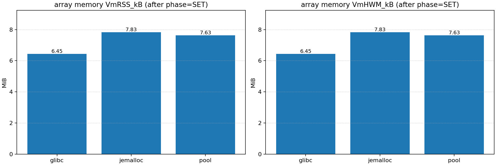
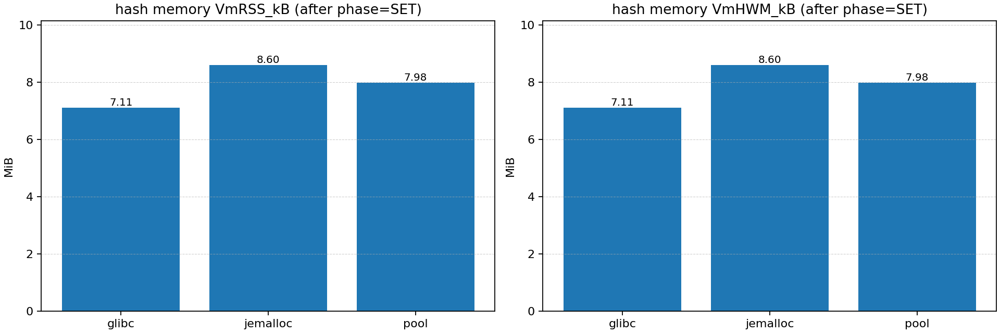
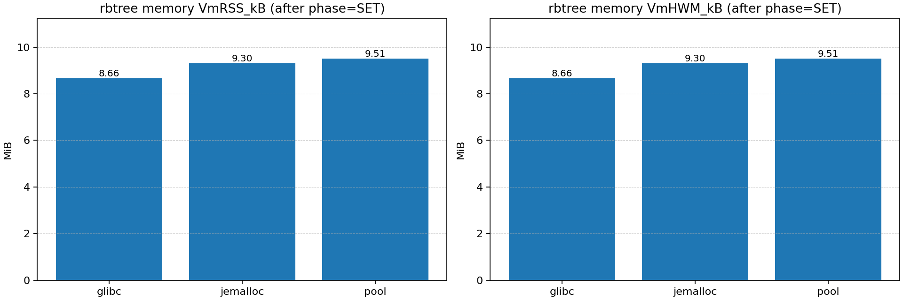
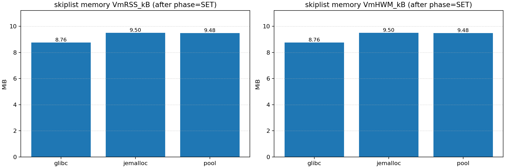
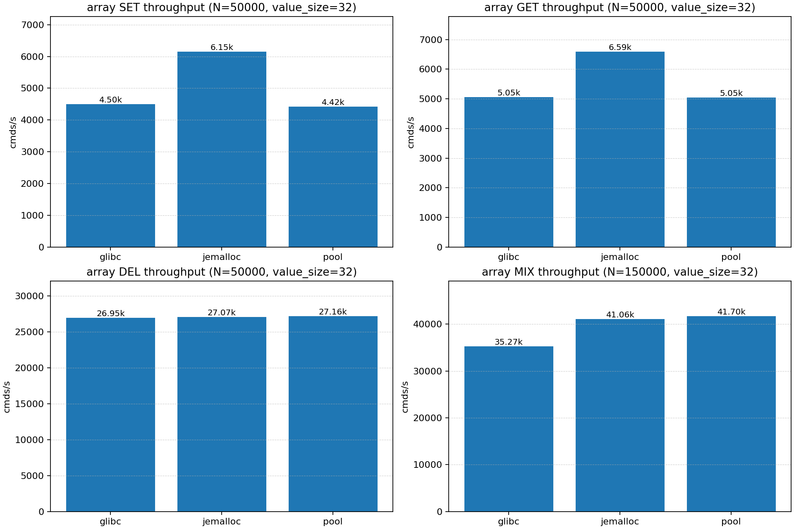
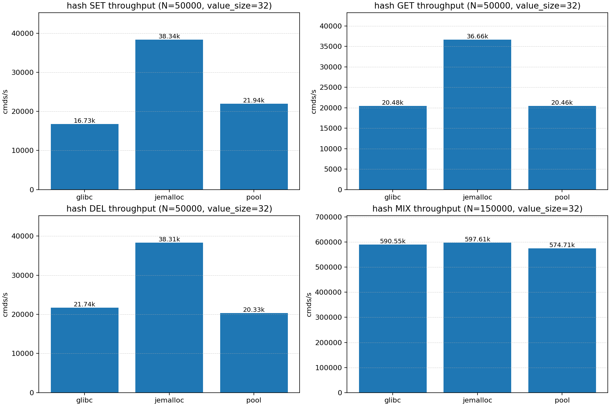
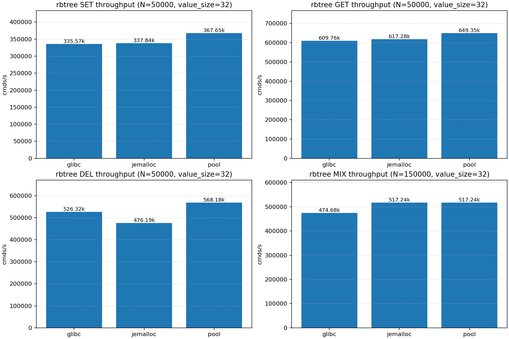
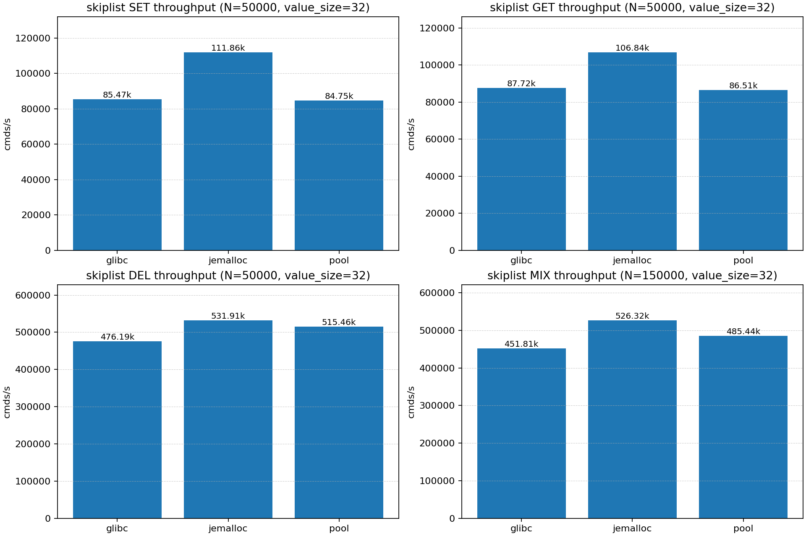
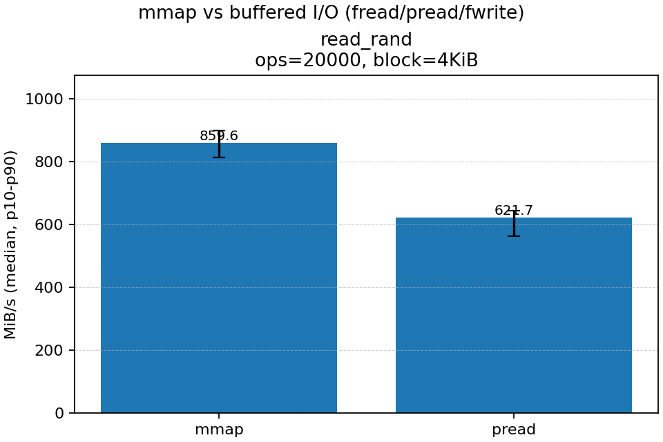

# KVStore

KVStore 是一个用 C 语言实现的键值存储服务端/客户端工具链，

项目特点：

- **双协议**：文本协议（兼容内置 testcase）+ RESP2（推荐，支持 pipeline）。
- **四套 KV 存储结构**：Array / Hash / RBTree / SkipList；通过命令前缀选择不同“KV 空间”（不是 Redis 的数据类型模型）。
- **Redis 风格持久化**：RDB（`save <seconds> <changes>` + `BGSAVE`）与 AOF（`appendonly/appendfsync` + `BGREWRITEAOF`）。
- **可切换网络后端**：reactor / proactor / ntyco。

---

## 快速开始

### 运行环境

- 推荐：Linux x86_64
- 必需：GCC、make、pthread、libdl
- 依赖提示：根目录 [Makefile](Makefile) 默认链接 `-luring`，即使不开启 proactor，也建议安装 `liburing-dev/liburing-devel`，或自行调整 `LDFLAGS`。

Ubuntu/Debian：

```bash
sudo apt-get update
sudo apt-get install -y build-essential liburing-dev
```

### 编译

```bash
make clean && make all
```

产物：

- `build/bin/kvstore-server`
- `build/bin/kvstore-cli`
- `build/bin/testcase`

### 启动

```bash
./build/bin/kvstore-server ./kvstore.conf
```

覆盖端口（优先级高于配置文件）：

```bash
./build/bin/kvstore-server ./kvstore.conf --port 2000
```

---

## 协议与交互

### 1) 文本协议（兼容 testcase）

直接发送类似 `SET k v` 的一行命令（以 `\n` 或 `\r\n` 结尾）；服务端按行解析。

说明：文本协议下的返回值是“项目自定义文本”（例如 `OK\r\n`、`NO EXIST\r\n`），不是 Redis 返回格式。

### 2) RESP2（推荐）

服务端解析 RESP Array + Bulk String：

```
*3\r\n$3\r\nSET\r\n$1\r\nk\r\n$1\r\nv\r\n
```

服务端会返回 **标准 RESP reply**（Simple String / Bulk / Integer / Error），支持 pipeline。

#### 大 value（GET/HGET/RGET/LGET）

核心处理链路是“流式协议处理器” `kvs_protocol_stream()`：当命令是 GET 类，并且 value 可能很大时，服务端会直接把 Bulk header + payload + CRLF 追加到连接回复缓冲，避免固定 `BUFFER_LENGTH=1024` 的响应缓冲截断。

限制：当前 value 仍以 C 字符串存储与处理（大量路径使用 `strlen()`），**不支持包含 `\0` 的二进制 payload**。

---

## 命令集（当前实现）

命令名大小写不敏感（服务端会统一转大写）。

### 1) Redis 最小互操作命令

- `PING [message]`
- `ECHO message`
- `SET key value`
- `GET key`
- `DEL key [key ...]`（RESP 模式下返回删除数量）
- `EXISTS key [key ...]`（兼容别名 `EXIST`）

### 2) 多结构命令（通过前缀选择不同 KV 空间）

这部分是本项目的特色：在内存里维护了 4 套独立结构，并用命令前缀选择落在哪一套。

- Array（默认）：`SET/GET/MOD/DEL/EXIST(S)`
- Hash（H 前缀）：`HSET/HGET/HMOD/HDEL/HEXISTS`（兼容别名 `HEXIST`）
- RBTree（R 前缀）：`RSET/RGET/RMOD/RDEL/REXISTS`（兼容别名 `REXIST`）
- SkipList（L 前缀）：`LSET/LGET/LMOD/LDEL/LEXISTS`（兼容别名 `LEXIST`）

### 3) 管理/兼容命令

- `BGSAVE`：fork 子进程写 RDB 临时文件，完成后 `rename()` 原子替换。
- `BGREWRITEAOF`：fork 子进程写“快照 AOF”，父进程继续服务并把增量写入 `.incr`，最后合并并原子替换。
- `CONFIG GET <key|*>`：当前实现支持 `appendonly/appendfilename/appendfsync/dir/dbfilename/save`。
- `INFO`：返回最小 server 信息（用于 redis-cli 探测）。
- `HELLO [2|3]` / `COMMAND` / `CLIENT SETINFO ...`：用于兼容新版 redis-cli 的握手与探测（不承诺完整 Redis 行为）。

---

## 持久化（RDB + AOF，Redis 风格语义）

### 1) RDB

- **触发**：按配置 `save <seconds> <changes>` 基于 `dirty` 与 `lastsave` 触发后台 `BGSAVE`。
- **文件格式**：写入 `REDIS0009`（RDB v9）并带 CRC64 校验；读取支持加载 Redis 生成的 RDB（仅 string KV 的最小子集）。
- **四结构落盘方式**：为了在单个 RDB 文件中保存 4 套结构，约定：DB0=Array, DB1=Hash, DB2=RBTree, DB3=SkipList。

### 2) AOF

- **追加格式**：写命令以 RESP 数组序列化后追加到 AOF（单条写聚合为一次 write）。
- **刷盘策略**：`appendfsync` 支持 `always/everysec/no`。
- **启动恢复**：先尝试加载 RDB，再回放 AOF；AOF 回放用 `mmap` + 原地解析，并把命令应用到内存结构。

### 3) BGREWRITEAOF（后台重写）

实现要点：

1. fork 子进程把当前内存快照写入 `appendonly.aof.tmp`（按结构遍历生成确定性命令流）。
2. 父进程继续对外服务：写命令仍追加到旧 AOF，同时把同样的增量命令写入 `appendonly.aof.incr`。
3. 合并线程等待子进程结束后，将 `.incr` 追加进 `.tmp`，然后 `rename()` 原子替换为新 AOF，并 reopen。

---

## 网络模型（可配置切换）

通过配置项 `network_backend` 选择后端：

- `reactor`：事件驱动（epoll）
- `proactor`：io_uring 异步 I/O（依赖 liburing）
- `ntyco`：NtyCo 协程网络封装

入口为统一事件循环 `kvs_eventloop_run_server()`，根据配置分发到各后端启动函数。

---

## 配置文件（kvstore.conf）

关键配置项：

```properties
port 2000

enable_persistence yes

dir log
dbfilename dump.rdb

# save ""  # 禁用 RDB 自动保存
save 900 1
save 300 10
save 60 10000

appendonly yes
appendfilename appendonly.aof
appendfsync everysec  # always / everysec / no

network_backend reactor  # reactor / proactor / ntyco
```

---

## 客户端与压测

### 1) hiredis / redis-cli / redis-benchmark（RESP）

使用hiredis：

```bash
git clone https://github.com/redis/hiredis.git
cd kvs-client
gcc c-hiredis-demo.c -I../../hiredis ../../hiredis/libhiredis.a -o hiredis-demo && ./hiredis-demo 127.0.0.1 2000
```

服务端支持 RESP，可用 redis-cli 交互（命令集以“当前实现”为准）：

```bash
redis-cli -h 127.0.0.1 -p 2000
```

压测示例：

```bash
redis-benchmark -h 127.0.0.1 -p 2000 -t set,get -n 100000 -c 50 -P 16 -d 4096 -r 10000
```

Hash 命令压测：

```bash
redis-benchmark -h 127.0.0.1 -p 2000 -t hset,hget -n 100000 -c 50 -P 16 -d 4096 -r 10000
```

### 2) C 版 CLI（kvstore-cli）

交互模式：

```bash
./build/bin/kvstore-cli -h 127.0.0.1 -p 2000
```

单条命令（文本协议）：

```bash
./build/bin/kvstore-cli -h 127.0.0.1 -p 2000 SET NAME NIE
./build/bin/kvstore-cli -h 127.0.0.1 -p 2000 GET NAME
```

RESP 模式（推荐）：

```bash
./build/bin/kvstore-cli --resp -h 127.0.0.1 -p 2000 SET k1 v1
./build/bin/kvstore-cli --resp -h 127.0.0.1 -p 2000 GET k1
```

### 3) RESP Pipeline（批量导入/压测）

当你需要做“类似 redis-cli --pipe”的批量导入或性能测试时，建议使用：

```bash
./build/bin/kvstore-cli --pipe --resp -h 127.0.0.1 -p 2000 --quiet
```

并确保输入文件是**严格 RESP + CRLF（`\r\n`）**。

生成 pipelines（二进制写入，强制 CRLF）：

```bash
python3 tools/gen_resp_pipelines.py --count 200 --out-dir ./tools --set-cmd HSET --get-cmd HGET --set-name pipeline_hset.resp --get-name pipeline_hget.resp
```

导入（写入）：

```bash
cat ./tools/pipeline_hset.resp | ./build/bin/kvstore-cli --pipe --resp -h 127.0.0.1 -p 2000 --quiet
```

读取验证：

```bash
cat ./tools/pipeline_hget.resp | ./build/bin/kvstore-cli --pipe --resp -h 127.0.0.1 -p 2000
```

### 4) Python RESP 示例（大 value 回环验证）

```bash
python3 kvs-client/resp_blog_test.py --file test.txt
```

---

## 功能测试（正确性）

### 1) 内置 testcase（文本协议）

用法：

```bash
./build/bin/testcase <ip> <port> <mode>
```

mode 列表（当前代码实现）：

- `0`：`array_testcase_10w`
- `1`：`rbtree_testcase_10w`
- `2`：`rbtree_testcase_3w`
- `3`：`hash_testcase`
- `4`：`hash_testcase_10w`
- `5`：`skiplist_testcase_10w`
- `6`：`array_testcase_2w`
- `7`：`hash_testcase_100w`（Hash：更大规模写改读删）
- `8`：`hash_batch_testcase`（批量发送/接收粘包处理验证，带 qps 统计）
- `9`：`rbtree_testcase_100w_pro`（RBTree：大规模交替写删模式）
- `10`：`hash_testcase_100w_pro`（Hash：大规模交替写删模式）

示例：

```bash
./build/bin/testcase 127.0.0.1 2000 4
```

> 说明：`testcase` 走的是文本协议（直接 send "SET k v"），适合用来做“相对对比”与快速回归；如果要测大 value 或批量 pipeline，更建议使用 RESP 客户端/自写压测脚本。

---
---

## 主从同步（eBPF replication，MVP）

该目录提供一个**可选**的 eBPF 复制骨架（默认不编译）：

- 主库每次写命令成功后，会把命令以 RESP 追加到 AOF，并触发稳定 uprobe hook：`kvs_ebpf_aof_append_hook(start_off, len)`。
- eBPF uprobe 监听该 hook，把 `(start_off, len)` 通过 ringbuf 发给用户态 agent。
- 用户态 agent 收到事件后，用 `pread()` 从 AOF 读取 `[start_off, start_off+len)` 的原始字节，通过 TCP 原样转发给副本。
- 副本收到字节后，按“回放 AOF”的方式解析并应用。

注意：复制由 AOF 追加驱动，因此主库必须启用 AOF。

### Prerequisites (Linux)

Ubuntu example:

```bash
sudo apt-get update
sudo apt-get install -y clang llvm gcc make pkg-config libbpf-dev libelf-dev zlib1g-dev
```

## Build

From the project root:

```bash
make ebpf
```

Artifacts:
- `ebpf/kvs_repl.bpf.o`
- `ebpf/kvs-repl-agent`

## Run (MVP: prints events + reads AOF bytes)

1) 确保主库配置启用 AOF（复制由 AOF 追加驱动）。
2) 按常规方式构建 server 二进制文件。
3) 获取 uprobe 钩子的符号偏移量：

```bash
nm -n build/bin/kvstore-server | grep kvs_ebpf_aof_append_hook
```

4) 运行代理程序（需要加载 BPF 的权限）：

```bash
cd ebpf
sudo ./kvs-repl-agent \
  --bin ../build/bin/kvstore-server \
  --aof ../log/appendonly.aof \
  --offset 0x82c0  \
  --dst 127.0.0.1:3000 \
  --verbose
```

性能测试：
1：对比 **三种内存策略**（glibc / jemalloc / 内存池）在 **四种结构**（array / rbtree / hash / skiplist）上的吞吐与内存占用。
## 0. 准备

- 进入目录：`cd kvstore`
- 确保可执行权限：`chmod +x bench/run_matrix.sh`
- 建议关闭持久化减少 IO 干扰：脚本默认用 bench 配置文件 [bench/bench.conf](bench/bench.conf)

## 1. 一键跑矩阵并生成 CSV

最常用（输出到 result.csv）：

`COUNT=50000 VALUE_SIZE=32 ./bench/run_matrix.sh > ./bench/out/result.csv`

参数含义：
- `COUNT`：每轮请求数（每个组合会跑一次 SET + 一次 GET）
- `VALUE_SIZE`：value 固定字节数（0 表示按 v{i} 这种短字符串）

## 2. 自动出图

安装 matplotlib：

`python3 -m pip install --user matplotlib`

出图命令：

`python3 bench/plot_results.py --csv ./bench/out/result.csv --out-dir bench/plots`

输出文件：
- `bench/plots/throughput_<struct>.png`：SET/GET 吞吐（cmds/s）
- `bench/plots/memory_<struct>.png`：内存占用（VmRSS/VmHWM，MiB）
  
  
  
  
  
  
  
  
## 3. 如何解读

- 主要看 `throughput_*.png`：同一结构下三种 mode 的柱状对比。
- 内存看 `memory_*.png`：写入后的常驻内存（RSS）与历史峰值（HWM）。


2: 在持久化的时候使用mmap对比pread/fread的性能差异：
- RDB 写入走 `fwrite`；RDB 加载走 `mmap`
- AOF 追加走 `write`；AOF 回放走 `mmap`

### 为什么使用随机读更能体现 mmap 优势

mmap 的使用点在 **AOF 回放 / RDB 加载**，本质属于“读 + 解析”的路径；而随机读对比更贴近实际原因是：
- `pread/fread`：每次读都要走 syscall，并把数据从内核页缓存拷贝到用户缓冲区（一次额外拷贝）。
- `mmap`：文件页直接映射到进程地址空间；随机访问时主要成本是 page fault + 页缓存命中后的内存访问，省掉大量 syscall/拷贝。

### 结果：
以 `RAND_OPS=20000`、`RAND_BLOCK=4KiB` 的随机读为例：
  
- AOF：mmap 中位数约 **735.8 MiB/s**，pread 中位数约 **413.5 MiB/s**，提升约 **1.78×**。
 
- RDB：mmap 中位数约 **747.4 MiB/s**，pread 中位数约 **411.3 MiB/s**，提升约 **1.82×**。

### 生成 CSV（读：mmap vs fread/pread）
一键完成“启动 server → 灌数据 → 触发 BGSAVE/BGREWRITEAOF → 只测随机读 → 自动出图”，用：

`chmod +x bench/run_persist_io_compare.sh && WORKLOADS=read_rand ./bench/run_persist_io_compare.sh`

输出：
- `bench/plots/io_compare.png`


## 常见问题


## 贡献与扩展建议
